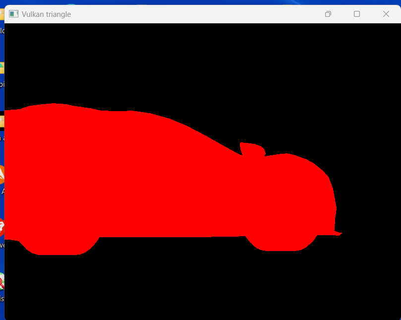

# r2e-vulkan

**Racing Rendering Engine (r2e)** — experimental real-time renderer built on raw Vulkan API.  
This project focuses on learning Vulkan by implementing a minimal, custom renderer from scratch.

---

## 🚧 Status

⚠️ Early prototype stage — basic rendering functionality, no advanced features yet.  
Expect instability and manual setup of Vulkan SDK environment.

---

## 🔧 Requirements

- Vulkan SDK installed and properly configured  
- C++17 compatible compiler (e.g., gcc, clang, MSVC)  
- CMake 3.10+  
- GLFW or SDL2 (depending on platform, if used)  

---

## 🛠️ Setup & Build

```bash
git clone https://github.com/grzesiekmq/r2e-vulkan.git
cd r2e-vulkan
cmake .
make
```

> If you're new to Vulkan, start with vulkan-tutorial.com to set up your development environment.


---

📚 Useful Resources

Raw Vulkan — Alain

Comparison of Modern Graphics APIs — Alain

## Screenshot 


---

*README assisted by ChatGPT.  
The project code and design were created solely by the author without AI assistance.*
